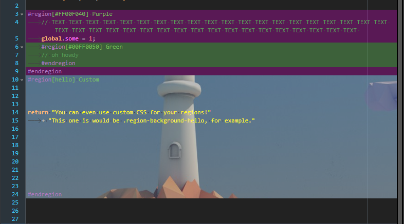

# region-backgrounds
Allows to give your regions custom backgrounds.

Syntax:
```gml
GMS2:
#region[#RRGGBBAA]...
...
#endregion
#region[class-suffix]...
...
#endregion
GMS1:
//#region[#RRGGBBAA]...
...
//#endregion
//#region[class-suffix]...
...
//#endregion
```
Regions are re-indexed when line count changes and after saving.

This isn't the most efficient, but I've not seen issues in my tests.

This may slightly increase the CPU load for cursor navigation in very large files.



For class suffix, open your custom CSS file (right-click something in tree view, pick "Custom icon" > "Open custom CSS file"), and add a rule for `.region-background-your-suffix` - for example, in the screenshot above I'm using
```
.region-background-hello {
	background-image: url(test.jpg);
	background-attachment: fixed;
	background-position: center;
	background-size: cover;
	opacity: 0.7;
}
```
with `test.jpg` sitting in project directory.

[Install instructions](https://github.com/GameMakerDiscord/GMEdit/wiki/Using-plugins#installing-plugins)